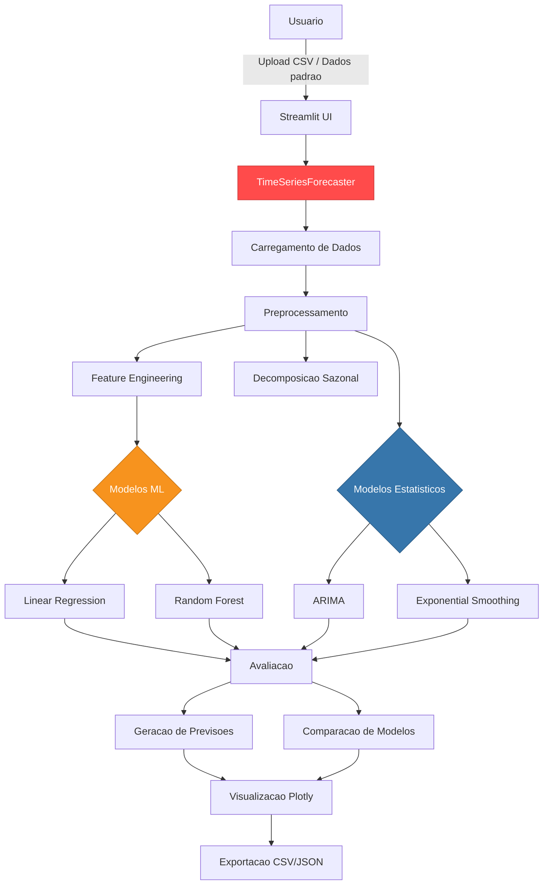
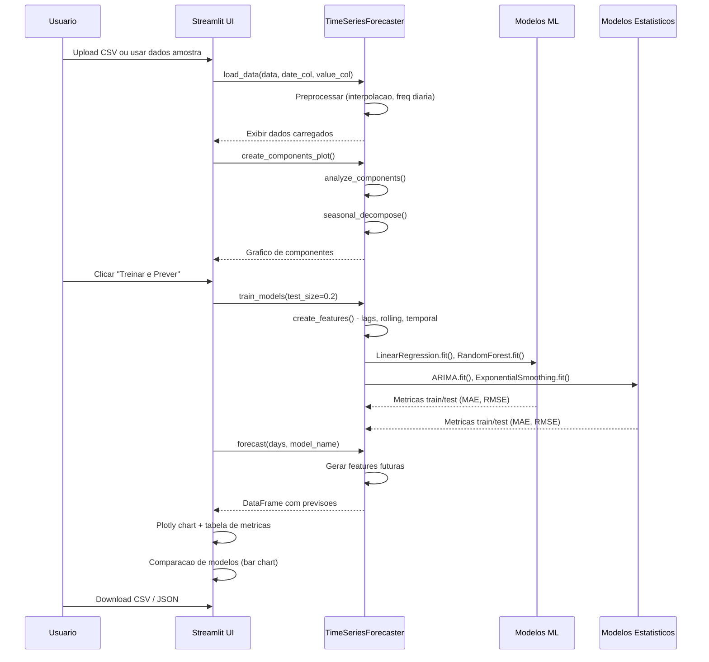
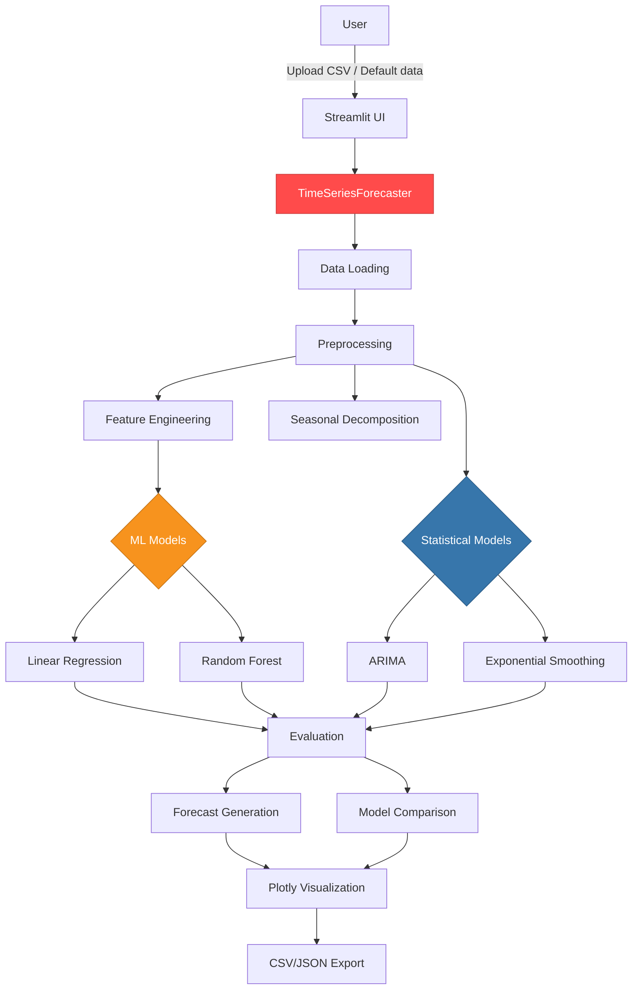
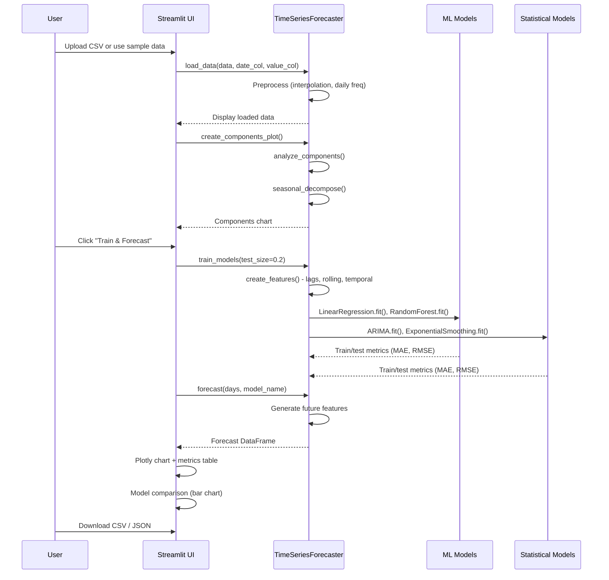

<div align="center">

# Time Series Forecasting Suite

[](https://python.org)
[](https://streamlit.io)
[](https://scikit-learn.org)
[](Dockerfile)
[](LICENSE)
[](test_forecasting_suite.py)

Suite completa de previsao de series temporais com interface Streamlit e multiplos modelos.

Comprehensive time series forecasting suite with Streamlit interface and multiple models.

[Portugues](#portugues) | [English](#english)

</div>

---

## Portugues

### Sobre

Suite profissional de previsao de series temporais construida com Streamlit, oferecendo uma interface web interativa para upload de dados, treinamento de multiplos modelos e geracao de previsoes com exportacao de resultados. O sistema implementa quatro modelos de previsao: **Linear Regression** e **Random Forest** (via scikit-learn) para abordagem de machine learning com feature engineering temporal automatizado, e **ARIMA** e **Exponential Smoothing** (via statsmodels) para abordagem estatistica classica. Inclui decomposicao sazonal, comparacao automatica de modelos e exportacao de metricas.

### Tecnologias

| Tecnologia | Versao | Finalidade |
|------------|--------|------------|
| **Python** | 3.10+ | Linguagem principal |
| **Streamlit** | 1.28+ | Interface web interativa |
| **Pandas** | 1.3+ | Manipulacao de dados |
| **NumPy** | 1.21+ | Computacao numerica |
| **scikit-learn** | 1.0+ | Modelos de machine learning |
| **statsmodels** | 0.13+ | Modelos estatisticos (ARIMA, ETS) |
| **Plotly** | 5.0+ | Visualizacoes interativas |
| **pytest** | 7.0+ | Framework de testes |

### Arquitetura



### Fluxo de Previsao



### Estrutura do Projeto

```
Time-Series-Forecasting-Suite/
├── forecasting_suite.py       # App Streamlit + classe TimeSeriesForecaster (~593 linhas)
├── test_forecasting_suite.py  # Suite de testes com 13 testes (~173 linhas)
├── examples/
│   ├── README.md              # Guia dos datasets de exemplo
│   ├── sales_data.csv         # Vendas varejo com sazonalidade
│   ├── temperature_data.csv   # Dados climaticos
│   └── stock_price_data.csv   # Dados financeiros com volatilidade
├── requirements.txt           # Dependencias Python
├── Dockerfile                 # Containerizacao
├── CONTRIBUTING.md            # Guia para contribuidores
├── CHANGELOG.md               # Historico de versoes
├── LICENSE                    # Licenca MIT
└── README.md                  # Documentacao
```

### Inicio Rapido

```bash
# Clonar o repositorio
git clone https://github.com/galafis/Time-Series-Forecasting-Suite.git
cd Time-Series-Forecasting-Suite

# Criar ambiente virtual
python -m venv venv
source venv/bin/activate  # Windows: venv\Scripts\activate

# Instalar dependencias
pip install -r requirements.txt

# Executar a aplicacao
streamlit run forecasting_suite.py
```

### Docker

```bash
# Build da imagem
docker build -t forecasting-suite .

# Executar container
docker run -p 8501:8501 forecasting-suite

# Acessar em http://localhost:8501
```

### Testes

```bash
# Executar suite completa (13 testes)
python -m pytest test_forecasting_suite.py -v

# Com cobertura
python -m pytest test_forecasting_suite.py --cov=forecasting_suite --cov-report=html

# Teste especifico
python -m pytest test_forecasting_suite.py::test_train_models -v
```

### Uso Programatico

```python
from forecasting_suite import TimeSeriesForecaster

# Inicializar
forecaster = TimeSeriesForecaster()

# Carregar dados (ou usar dados amostra)
df = forecaster.load_data()

# Treinar todos os modelos
models, metrics = forecaster.train_models(test_size=0.2)

# Gerar previsao
forecast = forecaster.forecast(days=30, model_name='Random Forest')

# Visualizar
fig = forecaster.create_forecast_plot('Random Forest')
fig.show()
```

### Benchmarks

| Operacao | Tempo Medio | Dataset |
|----------|-------------|---------|
| Carregamento + preprocessamento | ~100 ms | 1826 dias |
| Feature engineering | ~200 ms | 1826 dias |
| Treino Linear Regression | ~50 ms | 80% split |
| Treino Random Forest | ~2 s | 80% split, 100 arvores |
| Treino ARIMA(5,1,0) | ~3 s | 80% split |
| Treino Exponential Smoothing | ~1 s | 80% split |
| Previsao 30 dias | ~100 ms | Random Forest |
| Decomposicao sazonal | ~500 ms | 1826 dias |

### Aplicabilidade

| Setor | Caso de Uso | Descricao |
|-------|-------------|-----------|
| **Financas** | Projecao de ativos | Previsao de precos com Random Forest e ARIMA |
| **Varejo** | Previsao de vendas | Planejamento de estoque com sazonalidade detectada |
| **Meteorologia** | Projecao climatica | Analise de tendencias e padroes ciclicos |
| **Manufatura** | Previsao de demanda | Dimensionamento de producao com multiplos horizontes |
| **Saude** | Series epidemiologicas | Modelagem de curvas de incidencia |
| **Energia** | Consumo futuro | Projecao de carga para planejamento de rede |

---

## English

### About

Professional time series forecasting suite built with Streamlit, offering an interactive web interface for data upload, multi-model training and forecast generation with results export. The system implements four forecasting models: **Linear Regression** and **Random Forest** (via scikit-learn) for a machine learning approach with automated temporal feature engineering, and **ARIMA** and **Exponential Smoothing** (via statsmodels) for classical statistical approaches. Includes seasonal decomposition, automatic model comparison and metrics export.

### Technologies

| Technology | Version | Purpose |
|------------|---------|---------|
| **Python** | 3.10+ | Core language |
| **Streamlit** | 1.28+ | Interactive web interface |
| **Pandas** | 1.3+ | Data manipulation |
| **NumPy** | 1.21+ | Numerical computing |
| **scikit-learn** | 1.0+ | Machine learning models |
| **statsmodels** | 0.13+ | Statistical models (ARIMA, ETS) |
| **Plotly** | 5.0+ | Interactive visualizations |
| **pytest** | 7.0+ | Testing framework |

### Architecture



### Forecasting Flow



### Project Structure

```
Time-Series-Forecasting-Suite/
├── forecasting_suite.py       # Streamlit app + TimeSeriesForecaster class (~593 lines)
├── test_forecasting_suite.py  # Test suite with 13 tests (~173 lines)
├── examples/
│   ├── README.md              # Example datasets guide
│   ├── sales_data.csv         # Retail sales with seasonality
│   ├── temperature_data.csv   # Climate data
│   └── stock_price_data.csv   # Financial data with volatility
├── requirements.txt           # Python dependencies
├── Dockerfile                 # Containerization
├── CONTRIBUTING.md            # Developer guide
├── CHANGELOG.md               # Version history
├── LICENSE                    # MIT License
└── README.md                  # Documentation
```

### Quick Start

```bash
# Clone the repository
git clone https://github.com/galafis/Time-Series-Forecasting-Suite.git
cd Time-Series-Forecasting-Suite

# Create virtual environment
python -m venv venv
source venv/bin/activate  # Windows: venv\Scripts\activate

# Install dependencies
pip install -r requirements.txt

# Run the application
streamlit run forecasting_suite.py
```

### Docker

```bash
# Build image
docker build -t forecasting-suite .

# Run container
docker run -p 8501:8501 forecasting-suite

# Access at http://localhost:8501
```

### Tests

```bash
# Run full suite (13 tests)
python -m pytest test_forecasting_suite.py -v

# With coverage
python -m pytest test_forecasting_suite.py --cov=forecasting_suite --cov-report=html

# Specific test
python -m pytest test_forecasting_suite.py::test_train_models -v
```

### Programmatic Usage

```python
from forecasting_suite import TimeSeriesForecaster

# Initialize
forecaster = TimeSeriesForecaster()

# Load data (or use sample data)
df = forecaster.load_data()

# Train all models
models, metrics = forecaster.train_models(test_size=0.2)

# Generate forecast
forecast = forecaster.forecast(days=30, model_name='Random Forest')

# Visualize
fig = forecaster.create_forecast_plot('Random Forest')
fig.show()
```

### Benchmarks

| Operation | Avg Time | Dataset |
|-----------|----------|---------|
| Loading + preprocessing | ~100 ms | 1826 days |
| Feature engineering | ~200 ms | 1826 days |
| Linear Regression training | ~50 ms | 80% split |
| Random Forest training | ~2 s | 80% split, 100 trees |
| ARIMA(5,1,0) training | ~3 s | 80% split |
| Exponential Smoothing training | ~1 s | 80% split |
| 30-day forecast | ~100 ms | Random Forest |
| Seasonal decomposition | ~500 ms | 1826 days |

### Applicability

| Sector | Use Case | Description |
|--------|----------|-------------|
| **Finance** | Asset projection | Price forecasting with Random Forest and ARIMA |
| **Retail** | Sales forecasting | Inventory planning with detected seasonality |
| **Meteorology** | Climate projection | Trend analysis and cyclic patterns |
| **Manufacturing** | Demand forecasting | Production sizing with multiple horizons |
| **Healthcare** | Epidemiological series | Incidence curve modeling |
| **Energy** | Future consumption | Load projection for grid planning |

---

## Autor / Author

**Gabriel Demetrios Lafis**
- GitHub: [@galafis](https://github.com/galafis)
- LinkedIn: [Gabriel Demetrios Lafis](https://linkedin.com/in/gabriel-demetrios-lafis)

## Licenca / License

MIT License - veja [LICENSE](LICENSE) para detalhes / see [LICENSE](LICENSE) for details.
